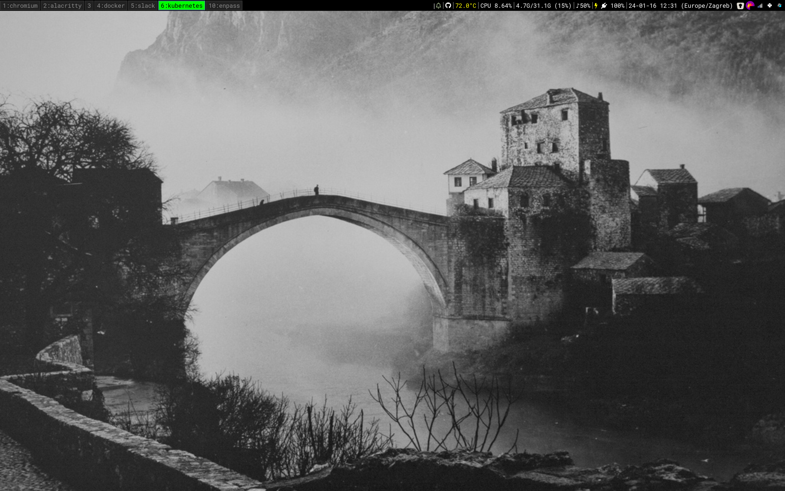
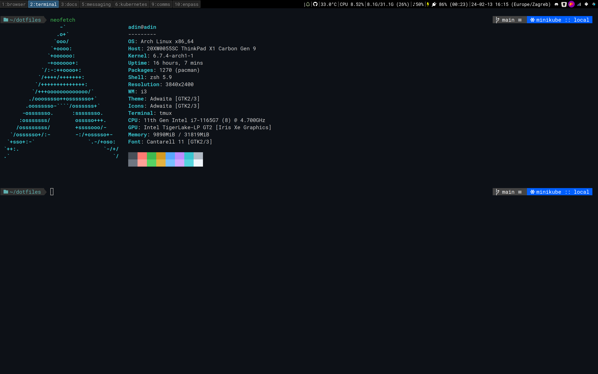
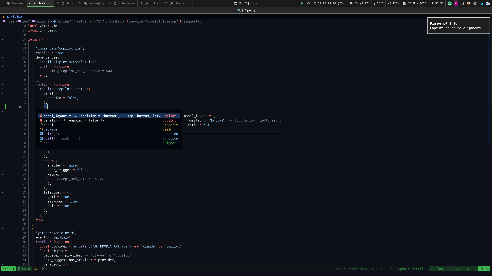

# My OS Setup

## Neovim Config

## Setup

- OS: [Arch Linux](https://archlinux.org/)
- WM: [i3](https://i3wm.org/)
- Launcher/Powermenu: [Rofi](https://github.com/davatorium/rofi)
- Terminal: [Alacritty](https://github.com/alacritty/alacritty)
- Shell: [Zsh](https://www.zsh.org/)
- Editor: [Neovim](https://neovim.io/)
- Fetch: [Neofetch](https://github.com/dylanaraps/neofetch)
- Notification Daemon: [dunst](https://github.com/dunst-project/dunst)
- Color scheme: [Gruvbox](https://github.com/morhetz/gruvbox)
