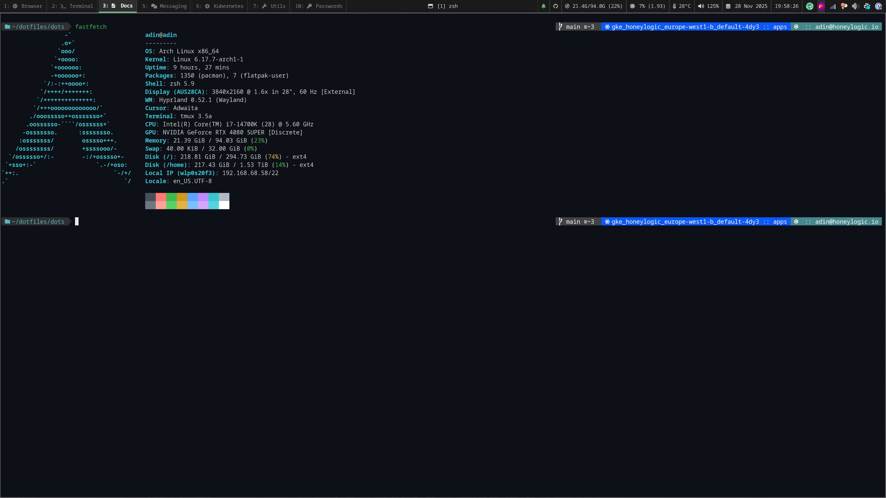

# My OS Setup

## Neovim Config

## Setup

- OS: [Arch Linux](https://archlinux.org/)
- WM: [Hyprland](https://github.com/hyprwm/hyprland)
- Terminal: [Ghostty](https://github.com/ghostty-org/ghostty)
- Shell: [Zsh](https://www.zsh.org/)
- Editor: [Neovim](https://neovim.io/)
- Launcher/Powermenu: [Rofi](https://github.com/davatorium/rofi)
- Notification Daemon: [dunst](https://github.com/dunst-project/dunst)
- Color scheme: [GitHub](https://github.com/projekt0n/github-nvim-theme)
